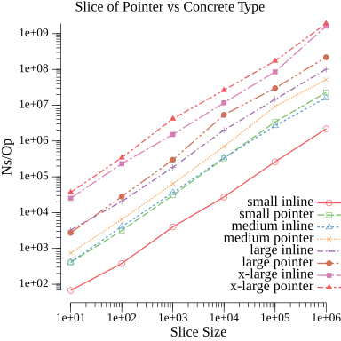

## Plot Results


## Text Results
```
$ cd benchmark
$ go test -benchmem -bench ./...
goos: linux
goarch: amd64
pkg: github.com/lock14/go-slice-benchmark
cpu: Intel(R) Xeon(R) W-2135 CPU @ 3.70GHz
BenchmarkSlice/Small_inline_slice_10_elements-12         	18244226	        69.23 ns/op	      80 B/op	       1 allocs/op
BenchmarkSlice/Small_inline_slice_100_elements-12        	 3232046	       360.7 ns/op	     896 B/op	       1 allocs/op
BenchmarkSlice/Small_inline_slice_1000_elements-12       	  294816	      3503 ns/op	    8192 B/op	       1 allocs/op
BenchmarkSlice/Small_inline_slice_10000_elements-12      	   45379	     27787 ns/op	   81920 B/op	       1 allocs/op
BenchmarkSlice/Small_inline_slice_100000_elements-12     	    4364	    253708 ns/op	  802825 B/op	       1 allocs/op
BenchmarkSlice/Small_inline_slice_1000000_elements-12    	     591	   2003124 ns/op	 8003587 B/op	       1 allocs/op
BenchmarkSlice/Small_pointer_slice_10_elements-12        	 3011120	       408.5 ns/op	     160 B/op	      11 allocs/op
BenchmarkSlice/Small_pointer_slice_100_elements-12       	  314598	      3568 ns/op	    1696 B/op	     101 allocs/op
BenchmarkSlice/Small_pointer_slice_1000_elements-12      	   38510	     33910 ns/op	   16192 B/op	    1001 allocs/op
BenchmarkSlice/Small_pointer_slice_10000_elements-12     	    3343	    299488 ns/op	  161920 B/op	   10001 allocs/op
BenchmarkSlice/Small_pointer_slice_100000_elements-12    	     322	   3832498 ns/op	 1602832 B/op	  100001 allocs/op
BenchmarkSlice/Small_pointer_slice_1000000_elements-12   	      54	  22944425 ns/op	16003616 B/op	 1000001 allocs/op
BenchmarkSlice/Medium_inline_slice_10_elements-12        	 2947428	       379.2 ns/op	     896 B/op	       1 allocs/op
BenchmarkSlice/Medium_inline_slice_100_elements-12       	  320994	      3435 ns/op	    8192 B/op	       1 allocs/op
BenchmarkSlice/Medium_inline_slice_1000_elements-12      	   38091	     33803 ns/op	   81920 B/op	       1 allocs/op
BenchmarkSlice/Medium_inline_slice_10000_elements-12     	    3734	    335020 ns/op	  802823 B/op	       1 allocs/op
BenchmarkSlice/Medium_inline_slice_100000_elements-12    	     459	   2528777 ns/op	 8003602 B/op	       1 allocs/op
BenchmarkSlice/Medium_inline_slice_1000000_elements-12   	      75	  15169859 ns/op	80003075 B/op	       1 allocs/op
BenchmarkSlice/Medium_pointer_slice_10_elements-12       	 1623141	       746.0 ns/op	     880 B/op	      11 allocs/op
BenchmarkSlice/Medium_pointer_slice_100_elements-12      	  208947	      6531 ns/op	    8896 B/op	     101 allocs/op
BenchmarkSlice/Medium_pointer_slice_1000_elements-12     	   18884	     64063 ns/op	   88192 B/op	    1001 allocs/op
BenchmarkSlice/Medium_pointer_slice_10000_elements-12    	    1755	    678515 ns/op	  881922 B/op	   10001 allocs/op
BenchmarkSlice/Medium_pointer_slice_100000_elements-12   	     138	   9179080 ns/op	 8802826 B/op	  100001 allocs/op
BenchmarkSlice/Medium_pointer_slice_1000000_elements-12  	      25	  52471061 ns/op	88003584 B/op	 1000001 allocs/op
BenchmarkSlice/Large_inline_slice_10_elements-12         	  415720	      3198 ns/op	    8192 B/op	       1 allocs/op
BenchmarkSlice/Large_inline_slice_100_elements-12        	   48808	     24995 ns/op	   81920 B/op	       1 allocs/op
BenchmarkSlice/Large_inline_slice_1000_elements-12       	    4903	    234763 ns/op	  802819 B/op	       1 allocs/op
BenchmarkSlice/Large_inline_slice_10000_elements-12      	     657	   2200252 ns/op	 8003599 B/op	       1 allocs/op
BenchmarkSlice/Large_inline_slice_100000_elements-12     	      91	  13373072 ns/op	80003090 B/op	       1 allocs/op
BenchmarkSlice/Large_inline_slice_1000000_elements-12    	      12	 102077741 ns/op	800006168 B/op	       1 allocs/op
BenchmarkSlice/Large_pointer_slice_10_elements-12        	  309728	      3251 ns/op	    9040 B/op	      11 allocs/op
BenchmarkSlice/Large_pointer_slice_100_elements-12       	   38179	     32549 ns/op	   90496 B/op	     101 allocs/op
BenchmarkSlice/Large_pointer_slice_1000_elements-12      	    3106	    366038 ns/op	  904197 B/op	    1001 allocs/op
BenchmarkSlice/Large_pointer_slice_10000_elements-12     	     218	   5360039 ns/op	 9041940 B/op	   10001 allocs/op
BenchmarkSlice/Large_pointer_slice_100000_elements-12    	      38	  28315163 ns/op	90402826 B/op	  100001 allocs/op
BenchmarkSlice/Large_pointer_slice_1000000_elements-12   	       6	 201930574 ns/op	904003600 B/op	 1000001 allocs/op
BenchmarkSlice/ExtraLarge_inline_slice_10_elements-12    	   45054	     25538 ns/op	   81920 B/op	       1 allocs/op
BenchmarkSlice/ExtraLarge_inline_slice_100_elements-12   	    3931	    257742 ns/op	  802819 B/op	       1 allocs/op
BenchmarkSlice/ExtraLarge_inline_slice_1000_elements-12  	     711	   1521064 ns/op	 8003588 B/op	       1 allocs/op
BenchmarkSlice/ExtraLarge_inline_slice_10000_elements-12 	      93	  11566605 ns/op	80003080 B/op	       1 allocs/op
BenchmarkSlice/ExtraLarge_inline_slice_100000_elements-12         	      12	  85377153 ns/op	800006160 B/op	       1 allocs/op
BenchmarkSlice/ExtraLarge_inline_slice_1000000_elements-12        	       1	1453062045 ns/op	8000004096 B/op	       1 allocs/op
BenchmarkSlice/ExtraLarge_pointer_slice_10_elements-12            	   36896	     36656 ns/op	   82000 B/op	      11 allocs/op
BenchmarkSlice/ExtraLarge_pointer_slice_100_elements-12           	    3081	    402649 ns/op	  820104 B/op	     101 allocs/op
BenchmarkSlice/ExtraLarge_pointer_slice_1000_elements-12          	     249	   4827065 ns/op	 8200222 B/op	    1001 allocs/op
BenchmarkSlice/ExtraLarge_pointer_slice_10000_elements-12         	      44	  24675851 ns/op	82001948 B/op	   10001 allocs/op
BenchmarkSlice/ExtraLarge_pointer_slice_100000_elements-12        	       6	 187778520 ns/op	820002848 B/op	  100001 allocs/op
BenchmarkSlice/ExtraLarge_pointer_slice_1000000_elements-12       	       1	2091756790 ns/op	8200003584 B/op	 1000001 allocs/op
PASS
ok  	github.com/lock14/go-slice-benchmark	76.041s
```
